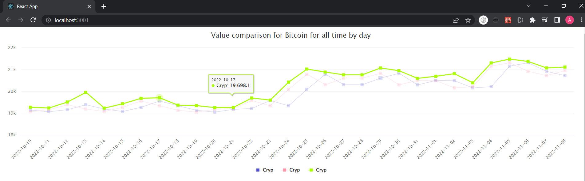
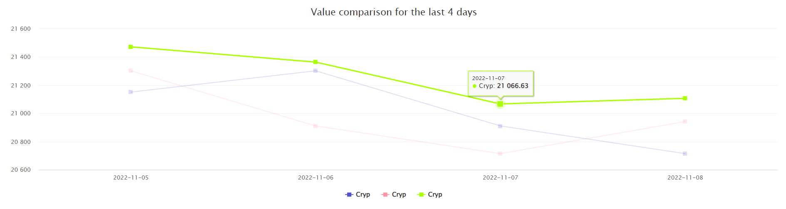
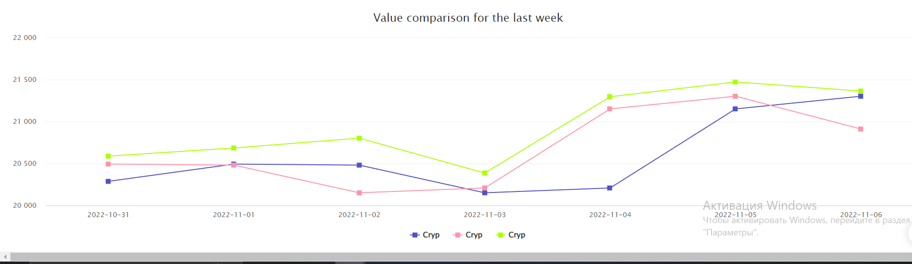

### `npm start`

Runs the app in the development mode.\
Open [http://localhost:3000](http://localhost:3000) to view it in your browser.

## `cd backend ---- node server.js`

Runs the app in the development mode.\
Open [http://localhost:8080].

### `cd backend/ cd graphs ----- npm run dev`

Runs the app in the development mode.\
Open [http://localhost:4000].

